# Sleep & Work Productivity Analysis

## Overview

This project analyzes the relationship between **sleep behavior and workplace productivity** using survey data from **127 respondents**.

The dataset contains information about sleep habits, sleep quality, energy levels, cognitive performance, emotional and social effects, physical tiredness, work output, and unproductive workdays.

The project follows a complete data analysis and machine learning workflow:

**Data Cleaning → Index Construction → Descriptive Analysis → Bivariate Analysis → Statistical Inference → Machine Learning**

A major part of the project is transforming individual survey questions into meaningful composite indices and combining them into an overall **Sleep Productivity Impact Index (SPI)**.

---

# The Questions Based on Section

## `1_Data_Cleaning.ipynb`

* How can the raw survey responses be cleaned and standardized?
* How should missing and unrealistic values be handled?

## `2_Index_Prep.ipynb`

* How can individual survey questions be transformed into meaningful sleep and productivity indices?
* How can these indices be combined into an overall SPI score?

## `3_univariate_desc_analysis.ipynb`

* What are the main distributions of sleep, energy, productivity, and SPI?
* What does the SPI distribution tell us about the respondents?

## `4_bivariate_desc_analysis.ipynb`

* What relationships exist between the sleep and productivity indices?
* How does energy level differ across respondent groups?

## `5_inf_analysis.ipynb`

* Are the observed relationships statistically significant?
* Are there significant differences between relevant groups?

## `6_MLs.ipynb`

* Can respondents be classified according to their SPI level?
* Which classification model provides the strongest performance?

---

# Tools I Used

### Programming & Analysis

* **Python**
* **Pandas** — data cleaning, transformation, and feature engineering
* **NumPy** — numerical calculations
* **Matplotlib** — visualization
* **Seaborn** — statistical visualization
* **SciPy** — statistical inference
* **Scikit-learn** — preprocessing, pipelines, classification, and evaluation

### Development

* **Jupyter Notebook** — analysis and documentation
* **VS Code** — project development
* **Git & GitHub** — version control and portfolio management

---

# Data Preparation and Clean Up

## `1_Data_Cleaning.ipynb`

The first notebook prepares the raw survey data for analysis.

### Main Steps

1. Load the Excel dataset.
2. Inspect the dataset and missing values.
3. Impute missing age values using the median.
4. Rename long survey questions into shorter analytical variable names.
5. Clean text-based responses.
6. Split the multi-response `sleep_factors` variable.
7. Identify unrealistic values in `unproductive_workdays_due_to_sleep`.
8. Replace invalid observations with missing values.
9. Impute the remaining missing productivity values.

For example, the original survey questions were converted into variables such as:

```text
work_productivity
sleep_productivity_effect
sleep_hours
wake_up_refreshed
difficulty_falling_asleep
difficulty_concentrating
careless_mistakes
physically_tired_at_work
unproductive_workdays_due_to_sleep
```

This made the dataset much easier to use in statistical analysis and machine learning.

### Notebook

[Open `1_Data_Cleaning.ipynb`](Notebooks/1_Data_Cleaning.ipynb)

---

# Index Preparation

## `2_Index_Prep.ipynb`

The second notebook focuses on **feature engineering**.

Instead of analyzing every survey question independently, related questions were grouped into composite indices. This provides a clearer representation of the different ways sleep can affect workplace performance.

## Sleep Quality and Hygiene Index — SQLI

The **Sleep Quality and Hygiene Index** combines five variables:

* Wake-up refreshed
* Difficulty falling asleep
* Waking up multiple times
* Weekend sleep schedule difference
* Device use before sleep

Because `wake_up_refreshed` originally has a positive interpretation, it was reverse-coded:

```python
df['wake_up_refreshed_reverse'] = 6 - df['wake_up_refreshed']
```

The resulting five-question score was normalized to a **0–100 scale**.

---

## Cognitive at-task Performance Index — CTPI

The **CTPI** measures cognitive difficulties during work.

It combines:

* Difficulty concentrating
* Careless mistakes
* Rereading due to focus loss
* Difficulty learning new skills
* Difficulty generating ideas
* Forgetting tasks/deadlines

The six-question score has a maximum raw score of **30** and is normalized to **0–100**.

---

## Emotional and Social Impact Index — ESII

The **ESII** captures emotional and interpersonal effects.

It combines:

* Irritability with colleagues
* Small setbacks becoming overwhelming
* Avoiding collaboration
* Difficulty controlling emotions

The maximum raw score is **20**, which is converted to a **0–100 scale**.

---

## Physical and Safety Risk Index — PSRI

The **PSRI** focuses on physical and safety consequences.

It combines:

* Physical tiredness at work
* Accidents due to tiredness

The maximum raw score is **10**, also normalized to **0–100**.

---

## Presentative Index — PI

The **Presentative Index (PI)** combines direct productivity consequences.

The current work-output responses were converted into productivity-loss fractions:

| Current Work Output      | Loss Fraction |
| ------------------------ | ------------: |
| About the same or better |          0.00 |
| 20–40% less              |          0.30 |
| 40–60% less              |          0.50 |
| 60–80% less              |          0.70 |
| 80–100% less             |          1.00 |

This is combined with the number of unproductive workdays caused by sleep.

The resulting PI is expressed on a **0–100 scale**.

---

## Overall Sleep Productivity Impact Index — SPI

The final SPI combines four impact dimensions:

```python
df['SPI'] = (
    df['CTPI']
    + df['ESII']
    + df['PSRI']
    + df['PI']
) / 4
```

The structure is:

```text
CTPI ─┐
ESII ─┤
PSRI ─┼──> SPI
PI   ─┘
```

This creates one overall measure representing the impact of sleep-related problems on workplace productivity.

### Notebook

[Open `2_Index_Prep.ipynb`](Notebooks/2_Index_Prep.ipynb)

---

# The Analysis

## `3_univariate_desc_analysis.ipynb`

The third notebook focuses on understanding individual variables before investigating relationships between them.

The analysis covers respondent characteristics, sleep variables, workplace energy, productivity measures, and the final SPI.

### SPI Distribution

The SPI distribution helps identify the general level and spread of sleep-related productivity impact across respondents.

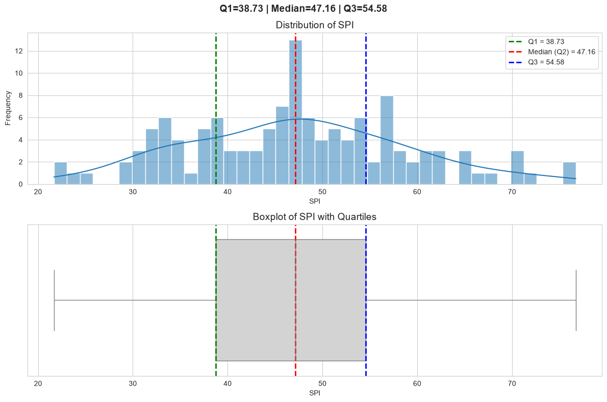

### Energy Levels During Work

Energy level provides an important workplace indicator because tiredness can influence concentration, productivity, and overall performance.

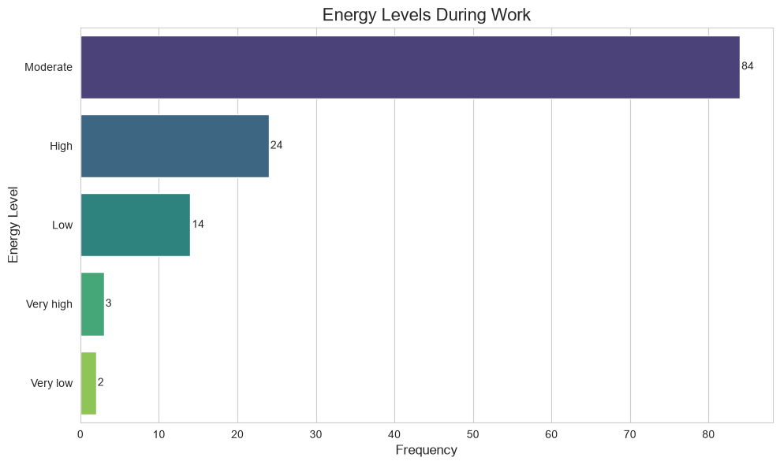

### Categorical Distributions

The pie charts summarize selected categorical variables and provide an overview of the composition of the survey sample.

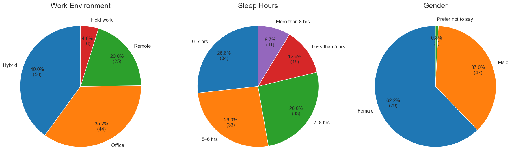

### Insights

The univariate analysis establishes the baseline characteristics of the dataset. It helps identify common response patterns, the distribution of workplace energy, and how widely SPI varies between respondents.

### Notebook

[Open `3_univariate_desc_analysis.ipynb`](Notebooks/3_univariate_desc_analysis.ipynb)

---

# `4_bivariate_desc_analysis.ipynb`

The fourth notebook examines relationships between variables.

The focus moves from:

**“What does each variable look like?”**

to:

**“How do these variables behave together?”**

## Correlation Between Sleep and Productivity Indices

The correlation matrix compares the major engineered indices:

* SQLI
* CTPI
* ESII
* PSRI
* PI
* SPI

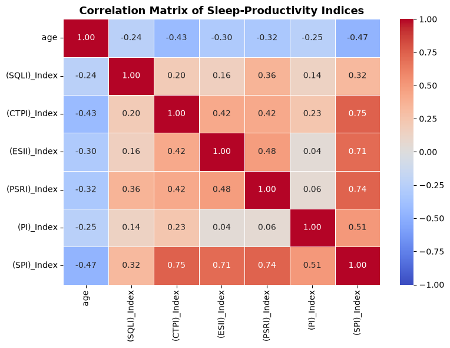

This makes it possible to identify which dimensions tend to move together and which components have stronger relationships with overall productivity impact.

## Gender and Energy Level

Energy levels are also compared across gender groups.

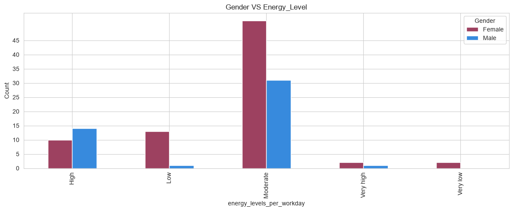

This provides a descriptive comparison that can later be evaluated using statistical inference.

### Insights

The bivariate analysis helps reveal the structure of the relationships within the dataset. In particular, the correlation analysis connects the individual index components with the overall SPI, while the group comparison provides a starting point for testing whether differences between groups are statistically meaningful.

### Notebook

[Open `4_bivariate_desc_analysis.ipynb`](Notebooks/4_bivariate_desc_analysis.ipynb)

---

# `5_inf_analysis.ipynb`

The fifth notebook applies **statistical inference** to the patterns identified during descriptive analysis.

The objective is to determine whether observed relationships and group differences are statistically significant rather than simply appearing different in the sample.

The analysis focuses on:

* Testing relationships between relevant sleep and productivity variables.
* Evaluating differences between respondent groups.
* Interpreting statistical evidence through hypotheses and significance levels.

This stage adds statistical support to the patterns identified in the descriptive analysis.

### Notebook

[Open `5_inf_analysis.ipynb`](Notebooks/5_inf_analysis.ipynb)

---

# `6_MLs.ipynb`

The final notebook applies machine learning to the SPI classification problem.

The continuous sleep-productivity impact measure is used to create a **three-class classification problem**.

Three models are evaluated:

1. Logistic Regression
2. Random Forest
3. Gradient Boosting

---

## Logistic Regression

Logistic Regression provides an interpretable baseline classification model.

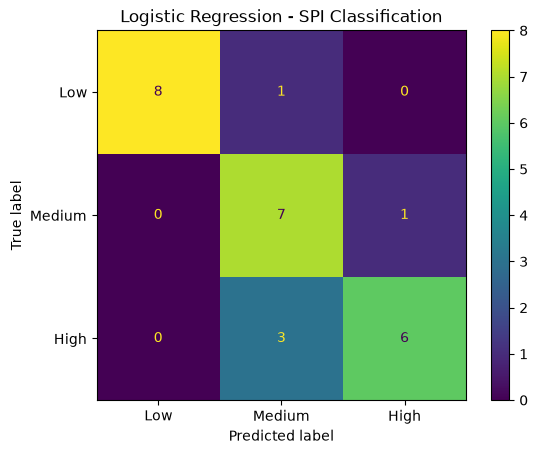

The preprocessing and modeling steps are combined into a pipeline:

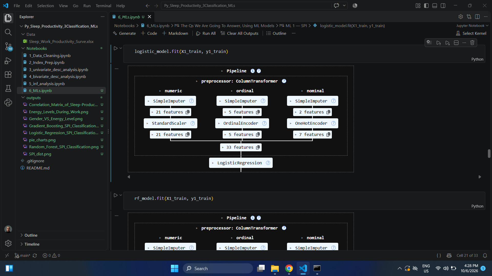

---

## Random Forest

Random Forest provides a nonlinear tree-based approach that can capture interactions between different predictors.

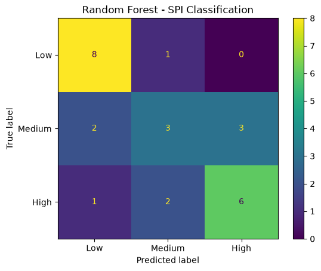

The preprocessing and model are organized into a reproducible pipeline:

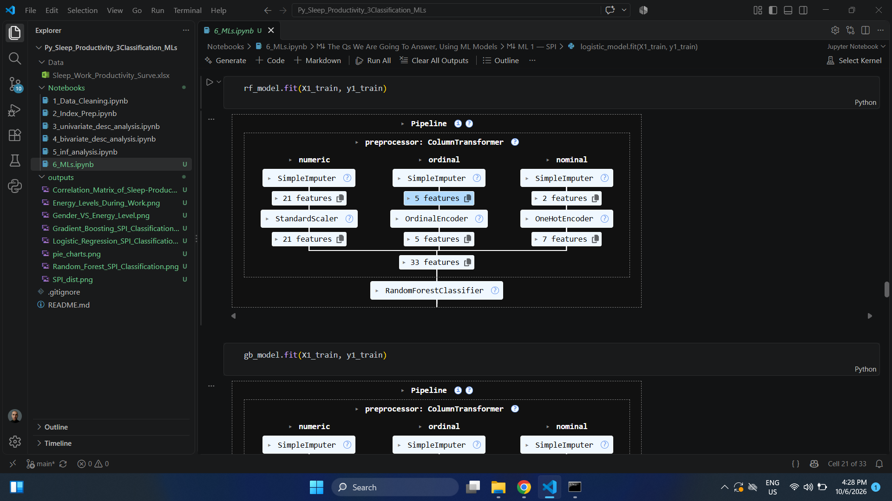

---

## Gradient Boosting

Gradient Boosting is another tree-based ensemble method. It builds models sequentially, allowing later models to improve on errors made by previous ones.

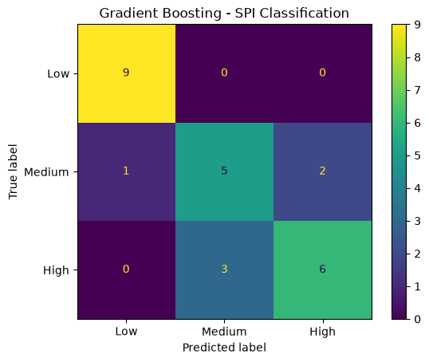

The complete preprocessing and modeling workflow is represented by:

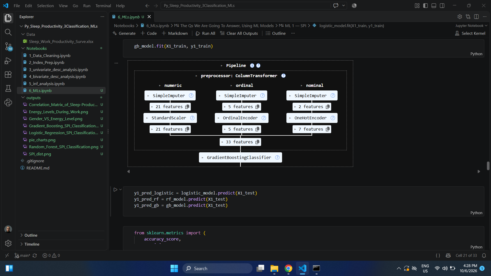

---

## Model Comparison

| Model               | Role in the Project       |
| ------------------- | ------------------------- |
| Logistic Regression | Interpretable baseline    |
| Random Forest       | Nonlinear ensemble model  |
| Gradient Boosting   | Sequential boosting model |

The models are compared using their classification performance to determine which approach is most appropriate for predicting SPI categories.

Using pipelines also makes the modeling process more reproducible by keeping preprocessing and prediction steps together.

### Notebook

[Open `6_MLs.ipynb`](Notebooks/6_MLs.ipynb)

---

# What I Learned

### Data Cleaning

I learned how to work with real survey data containing missing values, long question labels, categorical responses, and multi-response variables.

### Feature Engineering

The most important part of the project was converting individual questionnaire items into meaningful indices.

I practiced:

* Reverse coding.
* Score aggregation.
* Normalization.
* Creating domain-specific features.
* Combining multiple indices into a final target measure.

### Exploratory Data Analysis

I used univariate and bivariate analysis to understand distributions and relationships before moving to statistical modeling.

### Statistical Inference

I learned how descriptive patterns can be followed by formal hypothesis testing to determine whether observed differences and relationships are statistically supported.

### Machine Learning

I gained practical experience building and comparing:

* Logistic Regression
* Random Forest
* Gradient Boosting

I also learned the importance of preprocessing pipelines when building reproducible machine learning workflows.

### Data Storytelling

The project helped me connect the full analytical process:

```text
Survey Questions
      ↓
Clean Variables
      ↓
Analytical Indices
      ↓
Descriptive Statistics
      ↓
Relationships & Inference
      ↓
SPI Classification
```

---

# Challenges I Faced

### 1. Cleaning Survey Data

Survey data requires more preparation than a typical structured dataset because responses can contain missing values, inconsistent text, multiple selections, and unrealistic observations.

### 2. Creating Consistent Indices

The questionnaire variables did not always have the same direction or scale. Reverse coding and normalization were necessary to make the components comparable.

### 3. Defining Productivity Impact

Sleep can affect productivity through several pathways rather than one single outcome. The SPI therefore needed to combine cognitive, emotional, physical, and direct productivity effects.

### 4. Small Sample Size

The dataset contains only **127 observations**, so statistical and machine learning results need to be interpreted carefully.

A relatively small dataset can make model performance more sensitive to the train/test split and can limit how confidently the findings generalize to a larger population.

### 5. Moving From Analysis to Prediction

Another challenge was transforming the analytical SPI concept into a three-class machine learning problem while maintaining a consistent preprocessing workflow.

---

# Conclusion

This project analyzes how sleep-related factors can influence **workplace productivity and performance** using survey data from 127 respondents.

The project goes beyond simple descriptive statistics by constructing several domain-specific indices:

**SQLI → Sleep Quality & Hygiene**

**CTPI → Cognitive Performance**

**ESII → Emotional & Social Impact**

**PSRI → Physical & Safety Risk**

**PI → Direct Productivity Impact**

These components are combined to create the **Sleep Productivity Impact Index (SPI)**.

The analysis then investigates the distributions and relationships between these measures, applies statistical inference to evaluate observed patterns, and uses **Logistic Regression, Random Forest, and Gradient Boosting** to classify respondents according to their SPI level.

Overall, this project demonstrates a complete end-to-end workflow for transforming raw survey responses into **clean analytical features, statistical insights, and machine learning predictions**.

---
